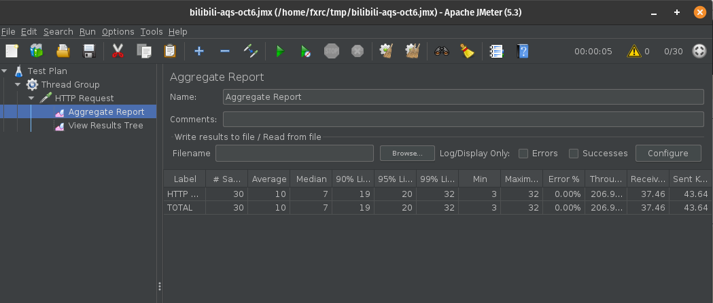
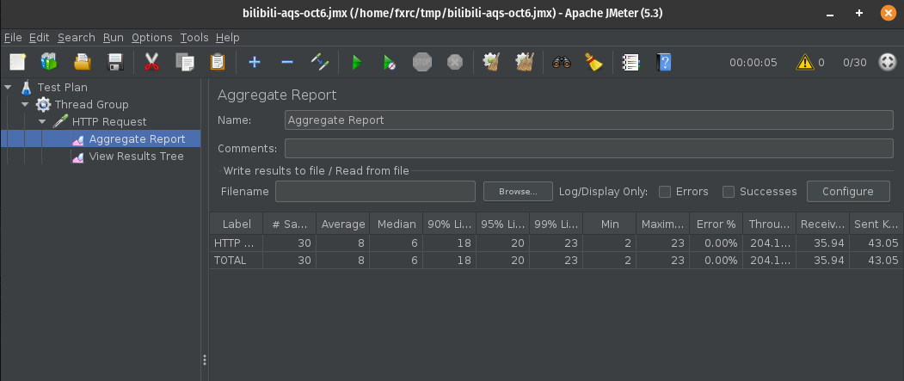

# Getting Started

## BAT面试必问--Java并发面试题AQS同步器核心原理剖析全集 
* BAT interview: Java Concurrency of AQS  
* video: https://www.bilibili.com/video/BV1TK411N7jS
* This is port of the code from video, using Spring boot, and springfox3.
* For mappings, can check Endpoints tab in Intellij.
    * h2 UI: localhost:8080/h2-console 
    
    * Swagger UI: http://localhost:8080/swagger-ui/index.html
    
    
## Steps
* single node Spring boot service for miaosha demo
* no lock on stock
* after it's up, goto H2 UI, then query with: `insert into shop_order values (1,5)`
* Use JMeter for load testing: 30 concurrent requests. 
    * add threads -> thread group.
        * Number of Threads (user): 30
        * Ramp-up period (seconds): 0
        * Loop Count:  1
    * add sampler in thread group: HTTP Request
        * set Path: http://localhost:8080/order/order?id=1
    * add listener
        1. Aggregate Report: This is the throughput, error rate, ...
        2. View Results Tree: This is to debug each request

### Raw
* Output from Spring boot app, and you can see 11 orders: over-ordered in miaosha! 
```shell script
2020-10-06 19:28:07.706  INFO 939333 --- [nio-8080-exec-2] com.example.aqs.service.TradeService     : success purchase, decrement stock, current stock 4
2020-10-06 19:28:07.709  INFO 939333 --- [nio-8080-exec-7] com.example.aqs.service.TradeService     : success purchase, decrement stock, current stock 3
2020-10-06 19:28:07.711  INFO 939333 --- [nio-8080-exec-4] com.example.aqs.service.TradeService     : success purchase, decrement stock, current stock 2
2020-10-06 19:28:07.711  INFO 939333 --- [nio-8080-exec-6] com.example.aqs.service.TradeService     : success purchase, decrement stock, current stock 4
2020-10-06 19:28:07.718  INFO 939333 --- [nio-8080-exec-5] com.example.aqs.service.TradeService     : success purchase, decrement stock, current stock 3
2020-10-06 19:28:07.723  INFO 939333 --- [nio-8080-exec-8] com.example.aqs.service.TradeService     : success purchase, decrement stock, current stock 2
2020-10-06 19:28:07.728  INFO 939333 --- [nio-8080-exec-3] com.example.aqs.service.TradeService     : success purchase, decrement stock, current stock 1
2020-10-06 19:28:07.739  INFO 939333 --- [nio-8080-exec-9] com.example.aqs.service.TradeService     : success purchase, decrement stock, current stock 0
2020-10-06 19:28:07.739 ERROR 939333 --- [nio-8080-exec-1] com.example.aqs.service.TradeService     : Out of stock!
2020-10-06 19:28:07.740  INFO 939333 --- [io-8080-exec-10] com.example.aqs.service.TradeService     : success purchase, decrement stock, current stock 0
2020-10-06 19:28:07.749 ERROR 939333 --- [nio-8080-exec-2] com.example.aqs.service.TradeService     : Out of stock!
2020-10-06 19:28:07.752 ERROR 939333 --- [nio-8080-exec-6] com.example.aqs.service.TradeService     : Out of stock!
...
2020-10-06 19:28:07.811 ERROR 939333 --- [nio-8080-exec-5] com.example.aqs.service.TradeService     : Out of stock!
```

### `Synchronized(SYNC_ROOT)`
* This can resolve the concurrent issue because of this lock. But it's not the focal point in this lecture.
* JMeter: 
* Log: no chaomai, so correct
```shell script
2020-10-06 19:46:25.856  INFO 972471 --- [io-8080-exec-16] com.example.aqs.service.TradeService     : success purchase, decrement stock, current stock 4
2020-10-06 19:46:25.862  INFO 972471 --- [io-8080-exec-13] com.example.aqs.service.TradeService     : success purchase, decrement stock, current stock 3
2020-10-06 19:46:25.872  INFO 972471 --- [nio-8080-exec-4] com.example.aqs.service.TradeService     : success purchase, decrement stock, current stock 2
2020-10-06 19:46:25.876  INFO 972471 --- [io-8080-exec-15] com.example.aqs.service.TradeService     : success purchase, decrement stock, current stock 1
2020-10-06 19:46:25.890  INFO 972471 --- [nio-8080-exec-3] com.example.aqs.service.TradeService     : success purchase, decrement stock, current stock 0
2020-10-06 19:46:25.901 ERROR 972471 --- [nio-8080-exec-8] com.example.aqs.service.TradeService     : Out of stock!
....
2020-10-06 19:46:25.994 ERROR 972471 --- [nio-8080-exec-6] com.example.aqs.service.TradeService     : Out of stock!
2020-10-06 19:46:25.995 ERROR 972471 --- [nio-8080-exec-5] com.example.aqs.service.TradeService     : Out of stock!
```